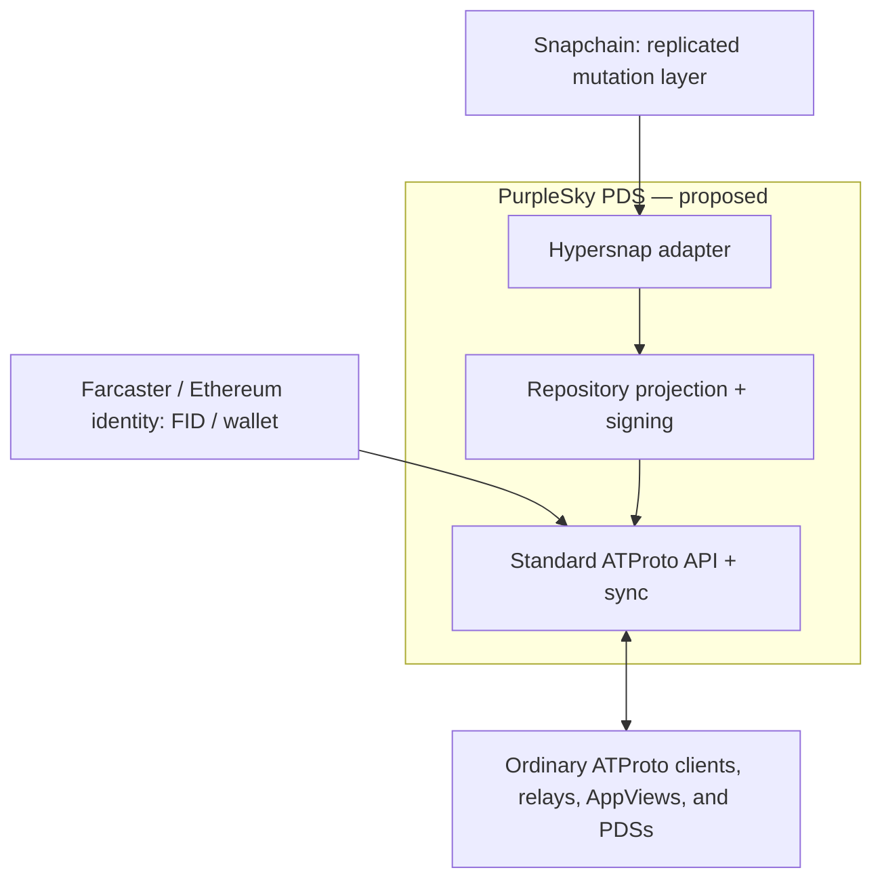

# PurpleSky

## ATProto over Snapchain

**Farcaster identity. ATProto interoperability. Snapchain persistence.**

PurpleSky proposes an **ATProto Personal Data Server (PDS) backed by Hypersnap/Snapchain**, allowing Farcaster / Ethereum identities to participate natively in the ATmosphere. This is a protocol composition experiment: use one decentralized protocol as infrastructure for another.

**Status: experimental, proposal stage.** Implementation work is beginning with the design. This repository currently contains the static proposal website and documentation, not a working PDS. None of the prototype milestones below has been demonstrated here. This is not production-ready.

Website: [psky.org](https://psky.org/)

> **Existing ATProto implementations should not need to know that Snapchain exists.**

The corresponding implementation test:

> **If an unmodified ATProto relay/AppView can consume and verify a PurpleSky repository, the abstraction is working.**

## Goals and non-goals

Goals:

- Authenticate with a Farcaster identity and/or associated Ethereum identity, binding account authority to a standard ATProto DID.
- Explore Hypersnap/Snapchain as the canonical replicated mutation layer behind a PDS.
- Expose ordinary ATProto records, repositories, CAR data, APIs, and firehose events.
- Let PurpleSky users and users of conventional PDSs follow, mention, and reply to one another natively.
- Test reconstruction, independent verification, recovery, and migration to a conventional PDS.

Non-goals for the initial experiment:

- Copying Farcaster posts into Bluesky as synthetic bridge accounts.
- Introducing `did:farcaster`, changing ATProto, or requiring Snapchain-aware clients, relays, or AppViews.
- Treating Snapchain consensus or a wallet signature as a substitute for ATProto repo signatures.
- Claiming that Farcaster and ATProto already share native message or signing semantics.
- Building a production network or full PDS before proving the smallest interoperability path.

## Architecture



The upward arrows describe the projection/read path. On the proposed write path, PurpleSky authenticates and authorizes the account, validates a mutation, persists it through the adapter, then projects and publishes the result after the required ordering/finality condition. The acknowledgment point is an open design decision.

The PDS boundary stays ordinary ATProto. Consumers resolve a DID and verification key, verify a signed repo commit, traverse its Merkle Search Tree (MST), and read standard records such as:

- `app.bsky.feed.post`
- `app.bsky.graph.follow`
- `app.bsky.actor.profile`

Like a PDS backed by SQLite, Postgres, or S3, the backing storage is an implementation detail. This boundary is the proposal's compatibility constraint, not an interoperability result already achieved.

## Identity and signing model

An illustrative account mapping is **ETH wallet → FID 403 → PurpleSky account → `did:plc:…` → ATProto repository**. Farcaster authentication can establish the FID directly; Ethereum authentication must prove the wallet's current authority for the FID. A wallet address alone is not an FID ownership proof.

Start with `did:plc`, or another currently interoperable ATProto-supported DID mechanism. The [DID specification](https://atproto.com/specs/did) currently supports `did:plc` and hostname-based `did:web`. No new DID method is proposed. Publish normal DID documents, verification keys, PDS service endpoints, and handle bindings.

Farcaster/ETH establishes account authorization; the ATProto DID is the public interoperability identity. Standard clients should use standard ATProto authorization, with wallet/Farcaster login behind the PDS's authorization interface. They should not need Farcaster-specific code. Wallet-only accounts, passkeys, and other authentication methods are possible future work, not committed admission mechanisms.

Each account still needs an ATProto repo signing key. The [repository specification](https://atproto.com/specs/repository) defines the signed commit and MST formats; [ATProto cryptography](https://atproto.com/specs/cryptography) defines the accepted signature semantics. Key custody, signing authorization, rotation, DID recovery authority, and the proof/revocation of an FID ↔ DID binding remain design work. Snapchain replication does not recover signing keys.

## Storage model and three integration levels

| Level                     | What is canonical?                              | Proposed path                                                         | Role                                                                                                       |
| ------------------------- | ----------------------------------------------- | --------------------------------------------------------------------- | ---------------------------------------------------------------------------------------------------------- |
| 1 — Block store           | ATProto repository structures                   | Records → MST / CAR / blocks → Snapchain storage                      | Simplest conceptual adapter; maximizes reuse of normal ATProto repo tooling.                               |
| 2 — Event log             | Accepted social mutations                       | Mutations → Snapchain → deterministic projection → ATProto repository | **Preferred research direction.** ATProto is an interoperable representation of replicated state.          |
| 3 — Shared native objects | A social operation meaningful to both protocols | One signed operation → Farcaster and ATProto views                    | Longer-term research only. Do not start here: identity, signing, repository, and message semantics differ. |

Even Level 1 requires a proven storage mechanism; it is not an existing integration.

For Level 2, the proposed log would describe operations such as:

```text
create app.bsky.feed.post/abc
update app.bsky.actor.profile/self
create app.bsky.graph.follow/xyz
delete app.bsky.feed.post/old
```

These are **conceptual operations, not a defined or supported Snapchain message format**. An envelope would need record content, stable record keys, authorization, ordering, timestamps, and versioned projection rules. Hypersnap is the candidate implementation to investigate; it is not interchangeable with every Snapchain deployment. Network selection, accepted message types, capacity limits, and any necessary adapter or network extensions must be established experimentally. No arbitrary durable append-only log capability is assumed.

The intended projection is **accepted history → records → MST → signed commit → standard sync/firehose**. Local blocks and indexes can be materialized views rather than the source of truth.

Deterministic record bytes and paths should reproduce the same MST root. Reproducing the _same signed commit CID_ additionally requires fixed revision/commit metadata and signature bytes, through a specified signing strategy or retained signed commits. Replaying state alone is insufficient. Cache recovery should not depend on replay-time clocks or newly generated record keys.

Retention is part of correctness: [Snapchain's design](https://github.com/farcasterxyz/snapchain/discussions/2) includes pruning. The chosen Hypersnap/Snapchain deployment needs an explicit policy for snapshots, historical availability, deletion, and recovery. Private keys and authentication secrets must not be stored in a public mutation log. Media blob availability and cleanup are separate questions from repository block storage.

Conceptually, one substrate could eventually expose an ATProto view, a Farcaster view, and future protocol views. Only the ATProto projection is the initial research target. Shared native operations and additional views remain open questions.

## Native participation: one graph, different storage

Alice uses a PurpleSky PDS, an FID and DID, and Snapchain persistence. Bob has a DID and uses a conventional PDS. Alice follows Bob by publishing a normal record in her ATProto repository:

```json
{
  "$type": "app.bsky.graph.follow",
  "subject": "did:plc:bbbbbbbbbbbbbbbbbbbbbbbb",
  "createdAt": "2026-09-15T00:00:00Z"
}
```

The example DID is a non-resolving placeholder. `createdAt` is included as required by the [follow Lexicon](https://github.com/bluesky-social/atproto/blob/main/lexicons/app/bsky/graph/follow.json).

Bob's PDS needs no knowledge of Alice's FID or storage. Mentions and replies should likewise use ordinary ATProto references. No translation gateway is required for normal behavior in either direction.

**Can two fundamentally different storage architectures participate transparently in the same ATProto social graph?** That is the experiment.

## Prototype milestones

All milestones are proposed and unchecked:

- [ ] **Validate the substrate.** Select and document a Hypersnap/Snapchain network and operation encoding; prove accepted mutations can be persisted, read back, and replayed under its retention rules.
- [ ] **Bind one identity.** One FID, one standard DID, Farcaster/ETH login, and explicit repo key custody. Test the binding's authorization and revocation assumptions.
- [ ] **Persist a tiny social state.** Profile, post, follow, plus updates and deletion; stable keys and a defined order for concurrent/retried mutations.
- [ ] **Project a valid repo.** Standard records, deterministic MST, normal independently verifiable signatures. Rebuild after discarding local projection caches and compare record CIDs and the root.
- [ ] **Expose sync.** Implement `com.atproto.sync.getRepo` and `com.atproto.sync.subscribeRepos` according to the [sync specification](https://atproto.com/specs/sync), with valid CAR exports/events and resumption behavior.
- [ ] **Demonstrate an unmodified consumer.** Publish a post from persisted Snapchain state and show an existing ATProto consumer/AppView consuming and correctly verifying it. Record the consumer/version, procedure, exported CAR, and verification output.
- [ ] **Probe failure and exit paths.** Restart/replay, stream gaps, deletion, key rotation, and migration to a conventional PDS retaining the DID and repository.

**The first meaningful proof is a post originating from state persisted through Snapchain appearing and verifying correctly in an unmodified ATProto consumer/AppView.**

Two sync endpoints are an initial proof surface, not a complete PDS. Standard client auth, discovery, repo APIs, identity/account events, blobs, account lifecycle, moderation-related behavior, and operational limits still matter. Public AppView indexing depends on service discovery and ingestion policies as well as protocol correctness.

## Open questions

1. What exactly should be canonical: Snapchain mutations or ATProto blocks?
2. How should an FID ↔ DID binding be represented, proven, revoked, and updated after an FID transfer?
3. Who controls and rotates the ATProto repo signing key, and who holds DID recovery authority?
4. Can repo reconstruction from Snapchain be fully deterministic, including the intended commit identity?
5. How should conflicting/concurrent mutations, retries, and publication finality be resolved?
6. How much Farcaster-native data can be represented directly using existing Lexicons?
7. What recovery path exists if PurpleSky disappears or log history has been pruned?
8. Can an account migrate to an ordinary PDS while retaining its DID and repository?
9. Could the same substrate eventually expose both Farcaster-native and ATProto-native protocol views?
10. Which Hypersnap network, mutation format, retention policy, and blob mechanism make this viable?

Protocol review, criticism, and small reproducible experiments are welcome in [issues](https://github.com/pierce403/psky/issues) and pull requests. This is an independent experiment, not an announced integration or endorsement by the underlying projects.

## Website development

The site is plain semantic HTML, CSS, original SVG graphics, and a small optional motion control. There is no framework, build step, external font request, analytics, or runtime dependency. Navigation, diagrams, and the expandable technical note remain usable without JavaScript. Animation respects `prefers-reduced-motion` and can be paused.

Serve the repository root with any static server, for example:

```sh
python3 -m http.server 8000
```

Open `http://localhost:8000`. Check desktop and narrow mobile layouts, keyboard navigation, the motion control, reduced motion, and JavaScript disabled. `social.svg` is the editable source for the 1200 × 630 social preview PNG; `favicon.svg` is the original node-based P mark, with PNG favicon and touch-icon fallbacks.

GitHub Pages publishes the root of `main`. Preserve `CNAME` (`psky.org`) and `.nojekyll`. Changes to the proposal site are documentation and presentation work; they do not establish protocol interoperability.

Further primary sources: [ATProto specifications](https://atproto.com/specs/atp), [Hypersnap source](https://github.com/farcasterorg/hypersnap), [Snapchain source](https://github.com/farcasterxyz/snapchain).
