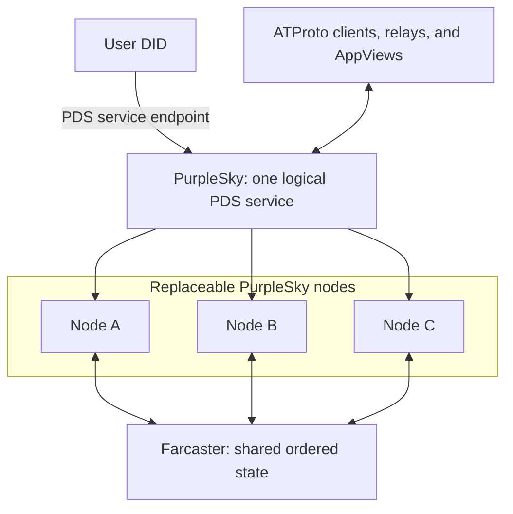
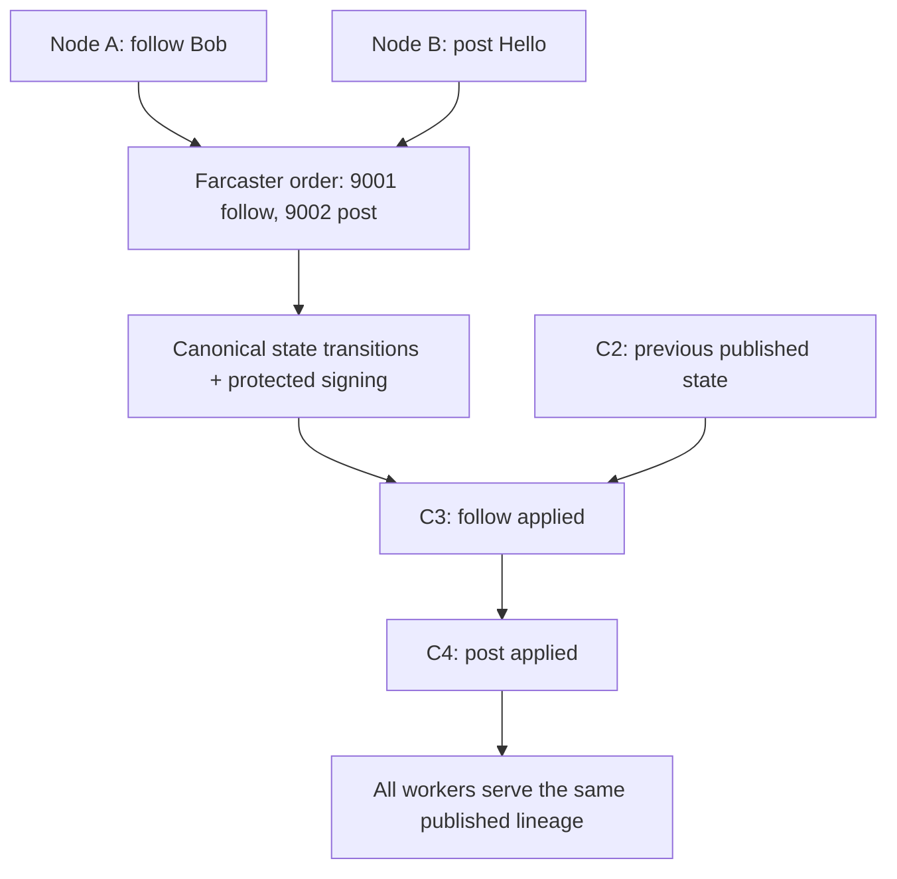
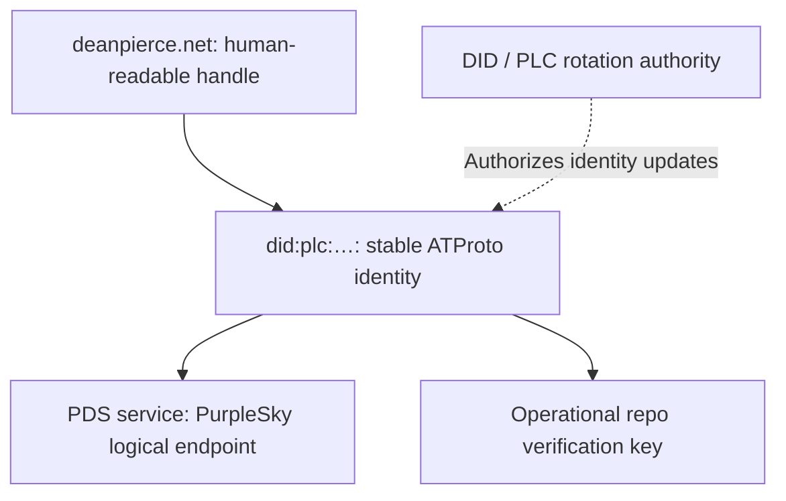

# PurpleSky

## ATProto over Farcaster

**ATProto over Farcaster. One logical PDS, many nodes.**

Farcaster as infrastructure. ATProto as the interface.

PurpleSky proposes a **distributed ATProto Personal Data Server (PDS) backed by the Farcaster protocol**. One logical service spans many replaceable nodes, preserving one canonical repository lineage per DID. Farcaster / Ethereum identities can participate natively in the ATmosphere. This is a protocol composition experiment: use one decentralized protocol as infrastructure for another.

**Status: experimental implementation.** The Rust workspace provides node preflight, offline reconstruction, a localhost console, Farcaster sign-in, and revocable Bluesky password sessions. The official session SDK passes against a local fixture account. Live user consent, public identity resolution, social APIs, protected publishing, and network reconstruction remain unproven. See [account setup](docs/authentication.md). The distributed network PoC below has not been demonstrated.

Website: [psky.org](https://psky.org/)

Implementation plan and acceptance criteria: [FEATURES.md](FEATURES.md).

Build, run, test, and generate API documentation: [docs/](docs/README.md).
Current storage findings: [Farcaster node storage feasibility](docs/storage-feasibility.md).

> **Existing ATProto implementations should not need to understand Farcaster.**

The corresponding implementation test:

> **If an unmodified ATProto relay/AppView can consume and verify a PurpleSky repository, the abstraction is working.**

## Goals and non-goals

Goals:

- Make account state belong to the shared substrate, with interchangeable workers behind one logical ATProto PDS endpoint.
- Preserve one authoritative repository lineage per DID even when writes enter through multiple nodes.

- Authenticate with a Farcaster identity and/or associated Ethereum identity, binding account authority to a standard ATProto DID.
- Explore Farcaster as the canonical replicated mutation layer behind a PDS.
- Expose ordinary ATProto records, repositories, CAR data, APIs, and firehose events.
- Let PurpleSky users and users of conventional PDSs follow, mention, and reply to one another natively.
- Test reconstruction, independent verification, recovery, and migration to a conventional PDS.

Non-goals for the initial experiment:

- Pinning accounts to PurpleSky machines, treating workers as independent PDSs, or merging independently authoritative ATProto repo forks.

- Copying Farcaster posts into Bluesky as synthetic bridge accounts.
- Introducing `did:farcaster`, changing ATProto, or requiring Farcaster-aware clients, relays, or AppViews.
- Treating shared-state consensus or a wallet signature as a substitute for ATProto repo signatures.
- Claiming that Farcaster and ATProto already share native message or signing semantics.
- Building a production network or full PDS before proving the smallest interoperability path.

## One logical PDS, many nodes

**Any node. Same repository.** A PurpleSky account is not permanently owned by, or pinned to, a PurpleSky machine. ATProto sees one logical PDS service; its implementation is distributed across interchangeable PurpleSky workers backed by shared Farcaster state.

> **The network is the PDS.** More precisely, PurpleSky presents a single logical PDS to ATProto while distributing its implementation across many nodes backed by shared Farcaster state.

This does not mean arbitrary Farcaster peers implement ATProto. PurpleSky workers implement the service boundary, under a common identity, authorization, publication, and consistency policy.

| Layer                | Responsibility                                                                                               | Durable account ownership                                                                                     |
| -------------------- | ------------------------------------------------------------------------------------------------------------ | ------------------------------------------------------------------------------------------------------------- |
| **Service identity** | Stable logical PDS endpoint advertised by the DID; standard OAuth, XRPC, repo, sync/firehose, and blob APIs. | The advertised service is PurpleSky, not a particular worker.                                                 |
| **PurpleSky nodes**  | Authenticate/authorize, submit mutations, reconstruct repositories, and serve standard APIs.                 | No permanent node ownership. Local DBs, indexes, MSTs, and CAR caches are reconstructable materialized state. |
| **Farcaster**        | Shared canonical replicated mutation substrate, ordering, and finality for the proposed projection.          | Account/repository state belongs to the shared substrate, subject to a proven retention/recovery design.      |



Any healthy, authorized, caught-up worker should eventually be able to authenticate Alice, read her current account/repository state, accept a mutation, submit it to shared ordering, derive the canonical resulting state, and serve her standard ATProto APIs. A new worker should be able to reconstruct from shared history or an authenticated bootstrap checkpoint without the old worker's local disk.

Service routing, node admission, shared authorization/session revocation, protected private account metadata, and read consistency remain implementation work. Authentication secrets do not belong in a public mutation log. A stale or partitioned node must catch up, forward, wait, or fail a request; it cannot claim to serve the current head or independently publish a competing head.

Users migrate **from an ordinary PDS to the PurpleSky logical PDS**. Switching PurpleSky workers is request routing/failover, not migration; the DID and logical service endpoint stay the same. Endpoint routing and the required availability model are open design choices, not guarantees already delivered.

## One canonical repository lineage per DID

> **Writes can enter through multiple nodes. ATProto must still see one authoritative repository lineage per DID.**

For example, node A receives `follow Bob` while node B receives `post Hello`. Neither independently chooses a new canonical head. Both submit to the same ordering/finality substrate; a possible accepted order is `#9001 follow`, then `#9002 post`. Deterministic transitions and the publication/signing policy yield one sequence of repo revisions.



`C2 → C3 → C4` denotes revision/state order, not a new hash-chain format or a requirement to populate the ATProto commit's `prev` field. Standard v3 repository commits normally use `prev: null`; valid monotonic revisions, MSTs, signatures, and sync semantics still apply. See the [repository specification](https://atproto.com/specs/repository).

Canonical mutation order alone does not settle all publication details. Specify per-DID commit boundaries, record keys, revisions, expected-state preconditions, conflict handling, idempotency keys, and retry semantics. Retrying through another worker must not apply a request twice. Publish only after the chosen finality condition and a valid signing step, with one canonical mapping from the ordered state to published commits.

Persist or otherwise recover the canonical commit metadata and signed artifacts so that workers at the same publication watermark serve the same revision and **signed commit CID**, not merely the same MST root. Signer failover needs fencing against competing publishers. The logical firehose needs consistent event ordering and resumable cursor semantics when a connection moves between workers. These remain open design problems.

## ATProto compatibility constraint

Existing clients, relays, AppViews, and other PDSs must not need Farcaster-specific code. Consumers resolve a normal DID and verification key, verify signed repo commits, traverse standard MSTs, and consume standard CAR data and records such as `app.bsky.feed.post`, `app.bsky.graph.follow`, and `app.bsky.actor.profile`.

Internally, PurpleSky obtains state and ordering from its shared substrate. Externally, it implements standard ATProto APIs and sync/firehose events. Ordering and finality do not replace ATProto signatures. Full OAuth/client authentication, account lifecycle, blobs, identity/account events, discovery, and operational behavior still need implementation; a pair of sync endpoints alone is not a complete PDS.

## Identity, authentication, and key layers

Prefer a normal `did:plc`, including an existing DID retained during migration. The [DID specification](https://atproto.com/specs/did) also supports hostname-based `did:web`; no `did:farcaster` or other new DID method is proposed.



This is an illustrative identity, not a claim about that domain's current DID or a migration performed here. Separately, the authorization path is **Farcaster/ETH → PurpleSky account authorization → operational ATProto signer**. The user's wallet does not directly sign every ATProto record; the operational repo key signs standard repository commits.

| Authority                            | Purpose                                                                                                                                        |
| ------------------------------------ | ---------------------------------------------------------------------------------------------------------------------------------------------- |
| Farcaster / Ethereum                 | Authenticate/authorize the PurpleSky user and prove the FID ↔ DID binding. A wallet address alone does not prove current FID authority.       |
| Operational ATProto repo signing key | Sign repo commits that existing ATProto implementations verify against the DID's repo verification key.                                        |
| DID / PLC rotation authority         | Authorize changes to identity metadata, such as the PDS service endpoint and operational verification key. This is distinct from repo signing. |

Standard clients should use standard ATProto authorization, with Farcaster/ETH login behind the logical service interface. Binding revocation, FID transfers, and session revocation must be consistent across nodes. Wallet-only accounts, passkeys, and Farcaster/ETH participation in recovery or rotation are research; they are not existing ATProto identity mechanisms.

### Distributed repo signing

**Any node accepting writes must not mean copying one hot private key onto every node.** Signing is an explicit distributed-systems and key-custody problem.

A first proof can use a **single protected signer service**: workers submit mutations to Farcaster; the signer authorizes confirmed canonical transitions, enforces the publication policy, produces ordinary ATProto signed commits, and makes the signed results recoverable by other workers. The repo key can remain isolated from the API nodes. This introduces a signing availability/trust bottleneck; restart, rotation, and fenced failover still need design.

Longer-term candidates include threshold signing, distributed signing, delegated short-lived signing authority, secure/HSM-backed signing, or another arrangement consistent with [ATProto cryptography](https://atproto.com/specs/cryptography). These are unproven options. Delegation cannot assume consumers accept a new certificate chain; threshold schemes must be researched against the required algorithms, public keys, encoding, and verification behavior.

> **Every externally visible repo commit must be a normal valid ATProto signed commit.**

## Migration onto and off PurpleSky

Hosting can change while an existing custom handle and DID remain stable:

| Field                | Before                          | After                                                |
| -------------------- | ------------------------------- | ---------------------------------------------------- |
| Custom handle        | `deanpierce.net`                | `deanpierce.net`                                     |
| ATProto identity     | Existing `did:plc:…`            | The **same** `did:plc:…`                             |
| DID's PDS service    | Current provider's PDS endpoint | PurpleSky's stable logical PDS endpoint              |
| Implementation       | Current provider's backend      | Distributed PurpleSky nodes + shared Farcaster state |
| Operational repo key | Current PDS's signing key       | May rotate to a PurpleSky signing arrangement        |

The custom domain can continue resolving to the same DID. The user need not extract the old PDS's private signing key. The applicable DID/PLC authority authorizes the service/key update. Following the [ATProto migration flow](https://atproto.com/guides/account-migration), import the repo and blobs, transfer relevant preferences, update identity metadata, and coordinate activation/deactivation so only one PDS remains authoritative.

Identity continuity is not automatic data recovery: imported repository contents need a shared, verified bootstrap checkpoint from which PurpleSky workers can reconstruct. Blob availability, handle control, and recovery authority must survive the move. Migration back to an ordinary PDS should retain the DID and repository too. These are proposed implementation requirements; the site does not perform migrations.

## Storage model and three integration levels

| Level                     | What is canonical?                              | Proposed path                                                         | Role                                                                                                       |
| ------------------------- | ----------------------------------------------- | --------------------------------------------------------------------- | ---------------------------------------------------------------------------------------------------------- |
| 1 — Block store           | ATProto repository structures                   | Records → MST / CAR / blocks → Farcaster storage                      | Simplest conceptual adapter; maximizes reuse of normal ATProto repo tooling.                               |
| 2 — Event log             | Accepted social mutations                       | Mutations → Farcaster → deterministic projection → ATProto repository | **Preferred research direction.** ATProto is an interoperable representation of replicated state.          |
| 3 — Shared native objects | A social operation meaningful to both protocols | One signed operation → Farcaster and ATProto views                    | Longer-term research only. Do not start here: identity, signing, repository, and message semantics differ. |

Even Level 1 requires a proven storage mechanism; it is not an existing integration.

For Level 2, the proposed log would describe operations such as:

```text
create app.bsky.feed.post/abc
update app.bsky.actor.profile/self
create app.bsky.graph.follow/xyz
delete app.bsky.feed.post/old
```

These are **conceptual projection operations, not existing Farcaster message types**. An envelope would need record content, stable record keys, authorization, ordering, timestamps, and versioned projection rules. Farcaster names the underlying protocol; the initial node choices and storage feasibility gate are tracked in [FEATURES.md](FEATURES.md). Accepted message types, capacity limits, ordering, and recovery must be established experimentally using existing nodes. No arbitrary durable append-only log capability or protocol extension is assumed.

The intended projection is **accepted history → records → MST → signed commit → standard sync/firehose**. Local blocks and indexes can be materialized views rather than the source of truth.

Deterministic record bytes and paths should reproduce the same MST root. Reproducing the _same signed commit CID_ additionally requires fixed revision/commit metadata and signature bytes, through a specified signing strategy or retained signed commits. Replaying state alone is insufficient. Cache recovery should not depend on replay-time clocks or newly generated record keys.

Retention is part of correctness. The [storage feasibility gate](FEATURES.md#storage-boundary-and-unresolved-gate) must account for pruning and establish explicit policies for snapshots, historical availability, deletion, and recovery. Private keys and authentication secrets must not be stored in a public mutation log. Media blob availability and cleanup are separate questions from repository block storage.

Conceptually, one substrate could eventually expose an ATProto view, a Farcaster view, and future protocol views. Only the ATProto projection is the initial research target. Shared native operations and additional views remain open questions.

## Native participation: one graph, different storage

Alice uses the PurpleSky logical PDS, an FID and DID, and Farcaster persistence. Bob has a DID and uses a conventional PDS. Alice follows Bob by publishing a normal record in her ATProto repository:

```json
{
  "$type": "app.bsky.graph.follow",
  "subject": "did:plc:bbbbbbbbbbbbbbbbbbbbbbbb",
  "createdAt": "2026-09-15T00:00:00Z"
}
```

The example DID is a non-resolving placeholder. `createdAt` is included as required by the [follow Lexicon](https://github.com/bluesky-social/atproto/blob/main/lexicons/app/bsky/graph/follow.json).

Bob's PDS needs no knowledge of Alice's FID or storage. Mentions and replies should likewise use ordinary ATProto references. No translation gateway is required for normal behavior in either direction.

**Can two fundamentally different storage architectures participate transparently in the same ATProto social graph?** That is the experiment.

## Prototype milestones: the distributed proof

These live-network steps remain unproved. The offline Rust harness tests repository encoding and reconstruction separately. First validate the chosen substrate's mutation admission, ordering/finality, retention/replay, and a protected signing path. Then demonstrate:

1. One FID / ETH-authorized user.
2. One ordinary `did:plc`.
3. A post submitted through PurpleSky node A.
4. Its mutation persisted and ordered through Farcaster.
5. Node B starting with empty local projection state.
6. Node B reconstructing the user's current repository from shared state.
7. Node B serving a valid `com.atproto.sync.getRepo`.
8. An unmodified ATProto consumer verifying that repository.
9. A second mutation submitted through B, followed by A serving the resulting head on the **same canonical repository lineage**.

> **Account state belongs to PurpleSky's shared substrate, not to a PurpleSky machine.**

At the same publication watermark, compare record CIDs, MST roots, revisions, and signed commit CIDs. Record the node/signer/consumer versions, procedure, CARs, and verification output. This proof tests interchangeable workers, not merely whether a backend can store a post.

Expand to profile, post, follow, updates/deletes, simultaneous writes through A/B, retries, cache loss, protected-signer failover, key rotation, and import/export. Implement `com.atproto.sync.subscribeRepos` according to the [sync specification](https://atproto.com/specs/sync), including resumption across node changes, without gaps, ambiguous cursors, or competing histories.

The original compatibility test still stands: **if an unmodified ATProto relay/AppView can consume and verify a PurpleSky repository, the abstraction is working.** Public AppView ingestion additionally depends on discovery and service policies. No distributed proof or full PDS implementation exists in this repository yet.

## Open questions

1. What exactly should be canonical: Farcaster mutations or ATProto blocks?
2. How should an FID ↔ DID binding be represented, proven, revoked, and updated after an FID transfer?
3. How do protected or distributed signing, key rotation, and fenced signer failover preserve one publisher, separately from DID/PLC rotation authority?
4. Can repo reconstruction from Farcaster be fully deterministic, including the intended commit identity?
5. How should finality, conflicting/concurrent mutations, retries, commit boundaries, and publication watermarks be resolved?
6. How much Farcaster-native data can be represented directly using existing Lexicons?
7. What recovery path exists if PurpleSky disappears or log history has been pruned?
8. Can an account migrate to an ordinary PDS while retaining its DID and repository?
9. Could the same substrate eventually expose both Farcaster-native and ATProto-native protocol views?
10. Which Farcaster message types, storage limits, retention policy, and blob mechanism make this viable?
11. How should the logical endpoint route requests and maintain shared auth/revocation, current reads, and resumable sync cursors across node changes?

Protocol review, criticism, and small reproducible experiments are welcome in [issues](https://github.com/pierce403/psky/issues) and pull requests. This is an independent experiment, not an announced integration or endorsement by the underlying projects.

## Website development

The site is plain semantic HTML, CSS, original SVG graphics, and a small optional motion control. There is no framework, build step, external font request, analytics, or runtime dependency. Navigation, diagrams, and expandable technical notes remain usable without JavaScript. The animated write enters B, is ordered and signed once, and becomes available at A/C as the same commit. It respects `prefers-reduced-motion`, can be paused, and remains a static diagram without JavaScript.

Serve the repository root with any static server, for example:

```sh
python3 -m http.server 8000
```

Open `http://localhost:8000`. Check desktop and narrow mobile layouts, keyboard navigation, the motion control, reduced motion, and JavaScript disabled. `social.svg` is the editable source for the 1200 × 630 social preview PNG. Open Graph and Twitter use the same absolute, versioned PNG URL; update its version when the artwork changes. Keep the headline legible at thumbnail size and preserve the experimental status label. `favicon.svg` is the original node-based P mark, with PNG favicon and touch-icon fallbacks.

GitHub Pages publishes the root of `main`. Preserve `CNAME` (`psky.org`) and `.nojekyll`. To verify deployment, check that the Pages job checks out the intended `main` SHA and uploads the root (`path: .`), wait for a successful deploy, then compare live HTML/CSS/JS/image bytes with that commit. Investigate branch/source/domain configuration before attributing stale content to caching. Versioned asset URLs keep updated diagrams/styles together after deployment. Changes to the proposal site are documentation and presentation work; they do not establish protocol interoperability.

Further primary sources: [ATProto specifications](https://atproto.com/specs/atp), [Farcaster protocol documentation](https://docs.farcaster.xyz/). Implementation-specific references and constraints are in [FEATURES.md](FEATURES.md).
